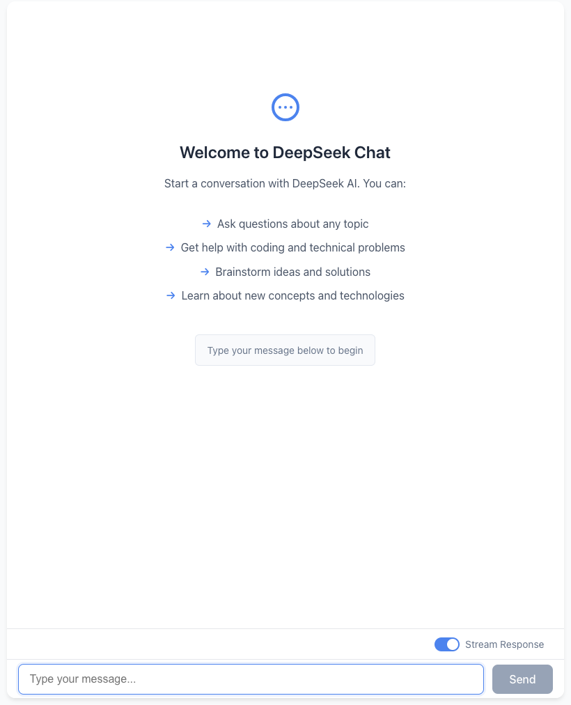

# Deepseek Chat Example

A simple example of using Deepseek Chat API with React.

## Setup

1. Clone this repository
2. Install dependencies: `pnpm install`
3. Set up environment variables:
   - Create a `.env` file in the root directory
   - Add the following line: `VITE_DEEPSEEK_URI=your_api_key`
4. Run the development server: `pnpm run dev`

## License

MIT
